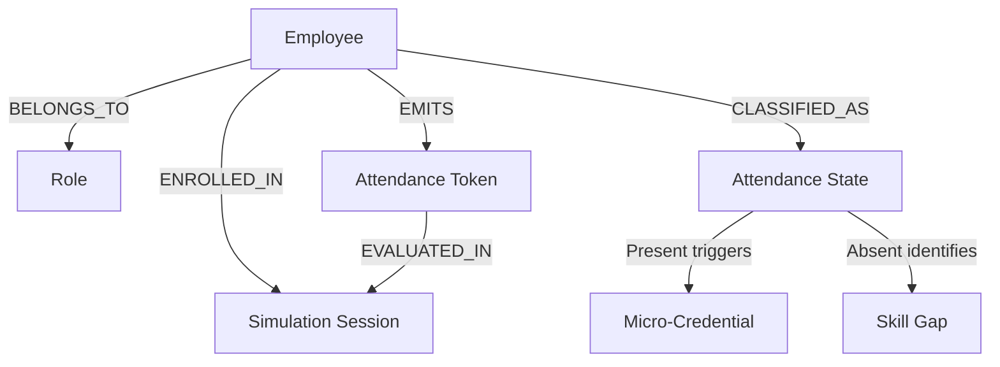

<div align="center">

# CoreSync

### Multi-Agent Reasoning Pipeline for Corporate Simulation Center Attendance Governance

<br/>

[](https://github.com/tomasgz7/CoreSync)
[](https://github.com/tomasgz7/CoreSync)
[](https://github.com/tomasgz7/CoreSync)
[](https://python.org)
[](https://azure.microsoft.com)
[](https://microsoft.com)
[](https://powerplatform.microsoft.com)
[](https://www.docker.com)

<br/>

> **CoreSync** is an autonomous multi-agent reasoning pipeline that reconciles fragmented
> Check-In and Check-Out attendance records submitted across parallel Simulation Center
> classrooms (Aula A / Aula B). It replaces a 30-day manual reconciliation cycle with
> real-time, grounded, and auditable attendance verdicts - powered by a Planner-Executor-Critic
> reasoning pattern, Microsoft Foundry IQ policy grounding, Work IQ-aware engagement, and
> PII-abstracted executive insights via Fabric IQ.

</div>

---

## The Problem

Corporate Simulation Centers run certification practice sessions across parallel physical
classrooms (Aula A and Aula B). Each classroom captures attendance independently through
separate digital forms, and certification policy requires **dual validation**: a candidate
is only verified Present if both a Check-In token and a Check-Out token are confirmed -
regardless of which classroom captured which event.

In practice, this dual-source, dual-token model produces a fragmented attendance landscape
that traditional automation cannot reconcile, forcing HR teams into a manual audit cycle
that takes up to **30 days** to consolidate attendance and issue micro-credentials.

| Pain Point | Impact |
|---|---|
| Check-In and Check-Out tokens land in different classroom systems (SYS-FORM-AULA-A / SYS-FORM-AULA-B) | No single source of truth per candidate |
| Employee ID format drift (`EMP-7721` vs `EMP7721`) across classroom forms | Failed pairing between Check-In and Check-Out records |
| HR control records injected after the fact (`SYS-HR-MATRICULA`) are mistaken for valid attendance tokens | False "Present" verdicts on incomplete attendance |
| Corrupted form submissions from origin database failures | Manual triage overhead, governance gaps |
| No grounded audit trail for attendance verdicts | Certification integrity risk, compliance exposure |
| Absentee employees receive generic, untargeted reminder campaigns | Low completion rates, notification fatigue |

---

## The Solution

CoreSync deploys a **five-agent reasoning pipeline**, plus a Foundry IQ grounding layer, where
each agent owns a single, well-defined responsibility. Every attendance verdict is produced
through an explicit **Planner-Executor-Critic** reasoning pattern, grounded against numbered
Foundry IQ Audit Rules - so every decision is traceable to a specific corporate policy, not a
free-form LLM inference.

- **Grounded multi-step reasoning** - the Reconciler Agent plans sub-tasks, executes a Chain
  of Thought, and runs an internal Critic pass that can override a false-positive verdict
  before it is ever emitted, citing the exact Audit Rule behind every decision
- **Cascading normalization** - Employee IDs and names are standardized across Aula A and
  Aula B sources before any pairing is attempted
- **Resilient batch processing** - one corrupted record (`%%CORRUPTED_ID%%`) does not halt
  the pipeline; it is isolated and routed to DataGovernance
- **Three-way segmentation** - every resolved pair is classified into `Presentes`,
  `Ausentes`, or `Sin_Respuesta`, each with an automated downstream action (credential
  issuance, engagement routing, or governance escalation)
- **Context-aware engagement** - absentee employees are never spammed; the Engagement Agent
  reads Work IQ signals (calendar load, M365 presence) to pick a non-intrusive outreach window
- **PII-abstracted executive insights** - the Insights Agent aggregates readiness,
  absenteeism, and escalation rates per certification track with zero individual identifiers,
  driving operational reporting latency toward zero

---

## Multi-Agent Architecture

CoreSync is composed of **five cooperating agents**, one Foundry IQ grounding connector, and
one Work IQ signal source feeding the engagement layer:

```
data/synthetic_records.json
         |
         v
[ Agent 1: Learning Path & Center Curator ]   agent/normalizer.py
  - Normalizes Employee IDs across Aula A / Aula B / HR sources
  - Strips diacritics and collapses whitespace in name fields
  - Generates SHA-256 hashes for PII-safe deduplication
  - Isolates structurally corrupted records without halting the batch
         |
         v
[ Foundry IQ Connector ]                      connectors/foundry.py
  - Retrieves 5 numbered Audit Rules from the grounding Knowledge Base
  - Injects AuditContext (rules + domain policies + trust scores) into the system prompt
  - Exposes get_rule(n) for direct citation by the Reconciler Agent
         |
         v
[ Agent 2: Reasoning Attendance Reconciler ]  agent/resolver.py
  - PLANNER:  decomposes each pair into ordered reconciliation sub-tasks
  - EXECUTOR: runs Chain of Thought grounded on the injected AuditContext
  - CRITIC:   audits the verdict against hard constraints, can override false positives
  - Emits ResolutionResult { match_status, confidence_score, segment, reasoning }
         |
         v
[ Agent 3: Data Segmenter & Enterprise Agent ]  agent/segmenter.py
  - Classifies each pair into Presentes / Ausentes / Sin_Respuesta
  - Enriches Ausentes with severity_flag (HIGH_SKILL_GAP_RISK / ATTENDANCE_ANOMALY_RISK)
  - Dispatches action_triggered per segment (credential / engagement / governance)
  - Writes data/output_segmentado.json
         |
         +----------------------------------------+
         |                                         |
         v                                         v
[ Agent 4: Contextual Engagement Agent ]   [ Agent 5: Manager Insights Agent ]
  agent/engagement.py                        agent/insights.py
  - Consumes Ausentes + Work IQ signals       - Aggregates all 3 segments
    (work_activity_signals.json)              - PII-abstracted readiness, absenteeism,
  - Picks non-intrusive delivery window         and escalation rates per certification
    and channel (Teams / Outlook)             - Severity & engagement channel distribution
  - Writes data/outreach_logs.json            - Writes data/manager_insights.json
         |                                         |
         v                                         v
   Teams / Outlook notifications          Power BI / Fabric IQ executive dashboards
```

### Agent Responsibilities

**`DataNormalizer` (agent/normalizer.py) - Learning Path & Center Curator Agent**
Stateless, side-effect-free curation agent. All methods are static, making it safe for
concurrent execution within a Foundry IQ-orchestrated runtime. Handles Employee ID format
normalization (stripping hyphens and separators), NFKD unicode decomposition for name
fields, SHA-256 hashing for PII-safe deduplication, and batch processing with per-record
error isolation - corrupted records (`%%CORRUPTED_ID%%`) are flagged without halting the run.

**`FoundryIQConnector` (connectors/foundry.py)**
Simulates retrieval of grounded audit policy documents from a Microsoft Foundry IQ indexed
Knowledge Base. Returns an `AuditContext` containing 5 numbered `AuditRule` objects, domain
attendance policies (`POL-SIM-01` through `POL-SIM-05`), and per-classroom source system
trust coefficients. The `get_rule(n)` accessor lets the Reconciler Agent cite specific rules
directly. In production, `fetch_audit_context()` replaces the in-memory fixture with an
authenticated Foundry IQ REST call backed by Dataverse.

**`DataResolver` (agent/resolver.py) - Reasoning Attendance Reconciler Agent**
The core reasoning agent and the project's primary differentiator. Implements a
**Planner-Executor-Critic** loop entirely inside the system prompt: the Planner stage
decomposes each pair into ordered sub-tasks, the Executor stage runs step-by-step Chain of
Thought grounded on the injected `AuditContext`, and the Critic stage audits the verdict
against hard constraints (e.g. "a manual HR note alone cannot satisfy the dual-token
requirement") before the final JSON is emitted. Returns a `ResolutionResult` with
`match_status`, `confidence_score`, `segment`, and a `reasoning` trace containing explicit
`[Grounded on: Audit Rule #N]` citations - or an `error_state` that never halts the pipeline.

**`DataSegmenter` (agent/segmenter.py) - Data Segmenter & Enterprise Agent**
Consumes the certified `ResolutionResult` list and partitions the cohort into the three
mandatory collections: `Presentes`, `Ausentes`, and `Sin_Respuesta`. Extracts the Audit Rule
citation from each reasoning trace, assigns a `severity_flag`, and dispatches the
corresponding business action (`EMIT_MICRO_CREDENTIAL_API_V1`, `ROUTE_TO_ENGAGEMENT_QUEUE`,
or `ISOLATE_IN_CRITICAL_LOG`). Writes the consolidated `output_segmentado.json` artifact.

**`ContextualEngagementAgent` (agent/engagement.py)**
Focuses exclusively on the `Ausentes` cohort. Loads Work IQ activity signals
(`work_activity_signals.json`) and applies a four-branch decision tree - high workload defers
to the employee's preferred slot via Outlook digest (citing Audit Rule #2), an active M365
meeting queues the notification, and low-load availability triggers an immediate Teams
message. Employees with no Work IQ signal fall back to a conservative next-business-day
digest. Writes `outreach_logs.json`.

**`ManagerInsightsAgent` (agent/insights.py)**
Aggregates the segmentation report and outreach logs into executive analytics: overall
readiness index, absenteeism and escalation rates, a per-certification-track breakdown
(`AZ-204-SIM`, `AI-102-SIM`, `DP-300-SIM`), severity distribution, and engagement channel
load. The output JSON is explicitly marked `"pii_abstracted": true` and contains zero
employee identifiers, ready for Power BI / Fabric IQ consumption. Also reports
`operational_report_latency_seconds` - the measurable proof of the 30-day-to-real-time claim.

---

## Microsoft Foundry IQ Integration

The central architectural decision in CoreSync is using Foundry IQ not just as an
orchestration layer, but as a **grounding mechanism against hallucination**, combined with
an internal **Critic/Verifier loop** that enforces hard business constraints regardless of
what the model concludes.

Without grounding, an LLM asked to reconcile two attendance records might produce a
confident but fabricated justification - for example, declaring an employee Present based
on a manual HR note. CoreSync prevents this in two layers:

1. **Grounding** - 5 numbered Audit Rules are injected into the system prompt before
   reasoning begins. The model is instructed to cite specific rules in its output.
2. **Critic override** - a set of *hard* rules (e.g. "a Present verdict requires both a
   Check-In AND a Check-Out token") are restated as non-negotiable constraints. If the
   Executor stage produces a verdict that violates them, the Critic stage overrides it
   before the JSON is emitted - with `confidence_score` forced to `>= 0.95` on any override.

The result: every `ResolutionResult.reasoning` field contains an explicit
Planner-Executor-Critic trace ending in a citation like `[Grounded on: Audit Rule #1,
Audit Rule #2]` - making each verdict traceable to a corporate policy rather than a
statistical pattern.

Active Foundry IQ Audit Rules (`connectors/foundry.py`):

| Rule | Title | Effect |
|---|---|---|
| #1 | Strict Attendance Pass - Dual Token Requirement | Present requires BOTH a Check-In and Check-Out token; an HR note alone is insufficient |
| #2 | Workload Anomaly Allowance | A missing Check-Out correlated with `workload_stress_index = HIGH` reduces severity to AT_RISK and routes to Engagement instead of immediate escalation |
| #3 | Clean Performance Validation - Perfect Score | `practice_score = 100` with both tokens confirmed -> confidence >= 0.97, auto-approved, triggers Micro-Credential issuance |
| #4 | Corrupted Record Isolation Protocol | Records matching `%%*%%` or producing an empty Employee ID are classified `Sin_Respuesta` and never reach the Reasoning Agent's credential path |
| #5 | Employee ID Cross-System Normalization | Hyphenated and flat Employee ID formats (`EMP-7721` vs `EMP7721`) are normalized to the same sequence before pairing |

---

## Fabric IQ Semantic Ontology

While Foundry IQ grounds individual reconciliation decisions, **Microsoft Fabric IQ** provides
the semantic layer that maps the entire business domain as a connected entity graph. This
ontology lets a manager trace, in real time, how a single attendance token propagates all the
way to a corporate impact metric - closing the loop between operational data and workforce
readiness reporting.



**Entity definitions:**

| Entity | Key Attributes |
|---|---|
| Employee | `employee_id`, `role`, `area` |
| Simulation Session | `pair_id`, `certification_target`, `source_system` |
| Attendance Token | `status` (REGISTERED / PENDING_VALIDATION), `submitted_at` |
| Attendance State | `Presentes` \| `Ausentes` \| `Sin_Respuesta` |
| Micro-Credential | `credential_id`, `issuance_date` |

**Relationship semantics:**

- `Employee -[BELONGS_TO]-> Role` - organizational classification used for severity weighting in the Manager Insights Agent.
- `Employee -[ENROLLED_IN]-> Simulation Session` - links a candidate to a specific certification track and classroom.
- `Employee -[EMITS]-> Attendance Token` - raw Check-In / Check-Out events from Aula A or Aula B.
- `Attendance Token -[EVALUATED_IN]-> Simulation Session` - the Reconciler Agent's Planner stage consumes this edge to gather all tokens for a session.
- `Employee -[CLASSIFIED_AS]-> Attendance State` - the output of the Data Segmenter & Enterprise Agent.
- `Attendance State (Presentes) -[TRIGGERS]-> Micro-Credential` - automated issuance via the Credential API.
- `Attendance State (Ausentes) -[IDENTIFIES]-> Skill Gap` - feeds the capability gap closing index in the executive insights report.

In a production deployment, this ontology is registered as a Fabric IQ semantic model so that
Power BI dashboards and the Manager Insights Agent query the **same graph definition** - eliminating
metric drift between operational pipelines and executive reporting.

---

## Deployment Architecture - Foundry Agent Service

CoreSync is designed to graduate from a local `--dry-run` simulation to a production-grade
**Hosted Agent** running on Azure AI Foundry Agent Service, with zero changes to the core
reasoning logic.

### Containerization Strategy

The entire pipeline is packaged into a single ultra-lightweight `python:3.11-slim` image.
A dedicated `entrypoint.sh` script boots the orchestration pipeline and automatically selects
`--dry-run` or `LIVE` mode based on the presence of `AZURE_AI_PROJECT_ENDPOINT`.

```bash
# Build the image locally
docker build -t coresync:latest .

# Run in dry-run mode (no Azure credentials required)
docker run --rm coresync:latest

# Run in live mode (requires AZURE_AI_PROJECT_ENDPOINT injected by Foundry Agent Service)
docker run --rm \
  -e AZURE_AI_PROJECT_ENDPOINT="https://<your-foundry-project>.services.ai.azure.com" \
  -e AZURE_AI_MODEL_DEPLOYMENT="gpt-4o" \
  coresync:latest
```

### Image Registry and Provisioning Flow

1. **Azure Container Registry (ACR)** - the image is built locally or via a GitHub Actions
   pipeline and pushed to a private ACR repository controlled by the organization.
2. **Hosted Agent Registration** - from the Azure AI Foundry portal, a new Hosted Agent is
   registered pointing to the ACR image URI. The service provisions isolated compute (CPU/memory)
   and exposes a secured HTTPS endpoint for consuming the agent.
3. **Configuration Injection** - runtime configuration is supplied exclusively through
   environment variables injected by the Foundry Agent Service runtime (see
   `env.production.example`). No `.env` files are ever shipped inside the image or committed
   to the repository.

### Keyless Architecture - Managed Identity

In production, CoreSync **never reads `AZURE_OPENAI_API_KEY`**. The Hosted Agent runs under a
Microsoft Entra ID Managed Identity with explicit RBAC role assignments:

| Role | Scope | Purpose |
|---|---|---|
| Cognitive Services OpenAI User | Azure OpenAI resource | Allows the Reasoning Agent to call the deployed GPT-4o model |
| Foundry IQ Knowledge Reader | Foundry IQ Knowledge Base | Allows `FoundryIQConnector` to retrieve grounded Audit Rules |

This eliminates static secrets from the deployment surface entirely - a credential leak from
the container image or registry cannot expose a usable API key, because none exists.

Furthermore, CoreSync is fully compliant with GitHub Secret Protection and Push Protection
policies, ensuring no tokens, credentials, or private API keys can ever be accidentally
committed to the repository.

### State Persistence for Long-Running Reconciliation

Bulk reconciliation runs across large cohorts may require sequential processing that exceeds a
single execution window. The Hosted Agent runtime natively mounts a state persistence volume
(`STATE_PERSISTENCE_PATH`), allowing CoreSync to:

- Resume a batch run after an unexpected container restart without reprocessing already-resolved pairs
- Preserve the in-memory `SegmentationReport` and `ExecutiveInsightsReport` traces across executions
- Maintain an uninterrupted analytical report for the Manager Insights Agent even during scaling events

---

## Tech Stack

| Layer | Technology | Role |
|---|---|---|
| Reasoning Engine | Azure OpenAI (GPT-4o) | Multi-step Chain of Thought conflict resolution |
| Agent Orchestration | Microsoft Foundry IQ | Policy grounding, agent lifecycle, memory |
| Semantic Layer | Microsoft Fabric IQ | Business ontology, entity graph for executive reporting |
| Data Layer | Microsoft Dataverse | Unified record storage, audit trail, escalation queue |
| Runtime | Python 3.11+ | Agent logic, normalization pipelines, connectors |
| Integration | Power Platform Connectors | Real-time triggers from HR and Learn source systems |
| Deployment | Docker + Foundry Agent Service | Containerized Hosted Agent, keyless Managed Identity auth |

---

## Quick Start

**Prerequisites**

Python 3.10 or higher. The Planner-Executor-Critic reasoning fixtures used in `--dry-run`
mode rely exclusively on the standard library, but `agent/resolver.py` and `agent/main.py`
import `openai` and `python-dotenv` at module level (required for `LIVE` mode), so these two
lightweight packages must be installed even for the dry-run:

```bash
git clone https://github.com/tomasgz7/CoreSync.git
cd coresync
pip install -r requirements.txt
```

**Dry-run simulation (no Azure credentials required)**

```bash
python agent/main.py --dry-run
```

**Expected terminal output (abbreviated):**

```
========================================================================
  CORESYNC - Multi-Agent Identity Governance
  Corporate Simulation Center | Microsoft Agents League 2026
  Mode: DRY-RUN (Planner-Executor-Critic simulation)
========================================================================

========================================================================
  [LEARNING PATH & CENTER CURATOR AGENT]  PHASE 1 - Synthetic Data
  Ingestion & Curation
========================================================================
    Raw records loaded              : 6
    Successfully normalized         : 6
    Failed normalization            : 0

    --------------------------------------------------------------------
    Ingested Record Sample
    --------------------------------------------------------------------
    RAW-001    | emp_id: EMP7721         | source: SYS-FORM-AULA-A       | norm_errors: 0
    RAW-002    | emp_id: EMP7721         | source: SYS-FORM-AULA-B       | norm_errors: 0
    RAW-005    | emp_id: EMP4412         | source: SYS-FORM-AULA-B       | norm_errors: 0
    ... and 3 more records.

========================================================================
  [FOUNDRY IQ CONNECTOR]  PHASE 2 - Foundry IQ Context Retrieval &
  Injection
========================================================================
  ============================================================
  FOUNDRY IQ - GROUNDED ATTENDANCE AUDIT CONTEXT
  Active Rules: 5 | Total Loaded: 5
  ============================================================
  [ ACTIVE AUDIT RULES ]
    Audit Rule #1 - Strict Attendance Pass - Dual Token Requirement
      Attendance is verified ONLY when both a digital Check-In token...
    Audit Rule #2 - Workload Anomaly Allowance
      If a missing Check-Out is correlated with a workload_stress_index...
  ...

========================================================================
  [REASONING ATTENDANCE RECONCILER AGENT]  PHASE 3 - Multi-Agent
  Reasoning & Rule Application  [3 pairs]
========================================================================

  Pair 01/03  |  PAIR-CONF-1001  |  AZ-204-SIM  |  [ PRESENT - AUTO ]
  --------------------------------------------------------------------
    Source A                        : RAW-001 (SYS-FORM-AULA-A)
    Source B                        : RAW-002 (SYS-FORM-AULA-B)
    Segment                         : Presentes
    Confidence Score                : 0.9800

    Planner-Executor-Critic Reasoning Trace:
      [PLANNER] Sub-tasks: (1) Normalize IDs across Aula A and Aula B...
      [EXECUTOR] Employee IDs 'EMP-7721' and 'EMP7721' normalize to the
      same sequence per Audit Rule #5. Practice score is 100...
      [CRITIC] Check-In and Check-Out tokens both confirmed. Verdict
      stands. Decision: PRESENT.
      [Grounded on: Audit Rule #3, Audit Rule #5]

  Pair 02/03  |  PAIR-CONF-1002  |  AI-102-SIM  |  [ ABSENT - RISK  ]
  ...
      [Grounded on: Audit Rule #1, Audit Rule #2]

  Pair 03/03  |  PAIR-CONF-1003  |  DP-300-SIM  |  [ SIN RESPUESTA  ]
  ...
      [Grounded on: Audit Rule #4]

========================================================================
  [DATA SEGMENTER & ENTERPRISE AGENT]  PHASE 4 - Segmentation & Action
  Dispatch
========================================================================
    Presentes  (action: EMIT_MICRO_CREDENTIAL)    : 1
    Ausentes   (action: ROUTE_TO_ENGAGEMENT)      : 1
    Sin_Respuesta (action: ISOLATE_CRITICAL_LOG)  : 1

========================================================================
  [CONTEXTUAL ENGAGEMENT AGENT]  PHASE 5 - Contextual Engagement: Work
  IQ Outreach Planning
========================================================================
    Ausentes records evaluated      : 1

  Employee: EMP9014  |  Certification: AI-102-SIM  |  Severity: ...
    Delivery channel                : Outlook_Digest
    Optimal window                  : Friday_Afternoon
    M365 status considered          : InAMeeting
    ...
    [Grounded on: Audit Rule #2 - Workload Anomaly Allowance]

========================================================================
  [MANAGER INSIGHTS AGENT]  PHASE 6 - Manager Insights & Executive
  Audit Report
========================================================================
  [ NOTE: All metrics below are PII-abstracted aggregates. ]

    Total cohort size               : 3
    Attendance verified (Presentes) : 1
    Absenteeism count (Ausentes)    : 1
    Unresolved count (Sin_Respuesta): 1
    Absenteeism rate                : 33.3%
    Escalation rate                 : 33.3%
    Overall readiness index         : 33.3%

    AZ-204-SIM     | candidates:  1 | present:  1 | at_risk:  0 | readiness: 100.0%
    AI-102-SIM     | candidates:  1 | present:  0 | at_risk:  1 | readiness: 0.0%
    DP-300-SIM     | candidates:  1 | present:  0 | at_risk:  0 | readiness: 0.0%

    Operational report latency      : 0.000XXXs

========================================================================
  CoreSync pipeline complete.
========================================================================
```

**Live run with Azure OpenAI**

```bash
cp env.example .env
# Edit .env with your credentials
python agent/main.py
```

---

## Project Structure

```
coresync/
├── agent/
│   ├── main.py                  - Pipeline orchestrator (6-phase, 5-agent execution)
│   ├── normalizer.py            - Curator Agent: ID and name normalization
│   ├── resolver.py              - Reconciler Agent: Planner-Executor-Critic reasoning
│   ├── segmenter.py             - Segmenter Agent: Presentes/Ausentes/Sin_Respuesta
│   ├── engagement.py            - Engagement Agent: Work IQ outreach planning
│   └── insights.py              - Insights Agent: PII-abstracted executive analytics
├── connectors/
│   ├── __init__.py
│   └── foundry.py               - Foundry IQ Knowledge Base connector
├── data/
│   ├── synthetic_records.json       - 100% fictional attendance dataset (3 pairs)
│   ├── work_activity_signals.json   - Work IQ activity signal fixtures
│   ├── output_segmentado.json       - Generated: segmentation artifact
│   ├── outreach_logs.json           - Generated: engagement outreach logs
│   └── manager_insights.json        - Generated: executive insights report
├── .gitignore
├── Dockerfile                   - Hosted Agent container image definition
├── entrypoint.sh                - Container entrypoint with mode auto-detection
├── requirements.txt             - Runtime dependencies (openai, python-dotenv)
├── env.example                  - Local development environment template
├── env.production.example       - Foundry Agent Service / Managed Identity template
├── README.md                    - Project documentation
└── test_normalizer.py           - Unit tests for DataNormalizer
```

---

> [!WARNING]
> **SYNTHETIC DATA DISCLAIMER**
>
> 100% of the dataset in `data/synthetic_records.json` and `data/work_activity_signals.json`
> consists entirely of fabricated, non-existent identifiers (e.g., `RAW-001`, `EMP-7721`,
> `PAIR-CONF-1001`, `AZ-204-SIM`).
>
> This dataset and the entire repository contain only General-level information suitable for
> public release. It contains NO personally identifiable information (PII), no real employee
> records, no real certification or attendance data, and no confidential information of any kind.
>
> All names, Employee IDs, scores, timestamps, and registration identifiers were invented
> solely for demonstration and evaluation purposes within the Microsoft Agents League
> Hackathon 2026. Generated artifacts (`output_segmentado.json`, `outreach_logs.json`,
> `manager_insights.json`) inherit the same fully synthetic, non-PII status.

---

## Compliance & Contribution

### Security & Secret Protection

CoreSync enforces a **zero-secrets-in-repository** policy at every layer of the development
and deployment lifecycle:

| Control | Mechanism | Enforcement Point |
|---|---|---|
| No static API keys | Managed Identity (Entra ID) replaces `AZURE_OPENAI_API_KEY` entirely | Runtime / Foundry Agent Service |
| Secret scanning | GitHub Secret Protection detects accidentally staged credentials before push | Pre-push / PR checks |
| Push protection | GitHub Push Protection blocks commits containing tokens or private keys | Git client / GitHub |
| No `.env` in image | `env.example` and `env.production.example` are templates only; actual `.env` files are `.gitignore`d | Dockerfile / `.gitignore` |
| RBAC-scoped identity | Managed Identity roles are least-privilege and scoped to individual Azure resources | Azure RBAC |

### Repository Classification

This repository and all of its contents are classified as **General** - suitable for public
release under the Microsoft Agents League Hackathon 2026 submission guidelines. No export
controls, data residency restrictions, or confidentiality obligations apply to any artifact
in this repository.

### Open Source Standards

- **Contributor License Agreement (CLA):** All submissions comply with standard CLA processes
  to protect both contributors and the program ecosystem.
- **Code of Conduct:** Community engagement, issues, and discussions within this repository
  strictly follow the Open Source Code of Conduct guidelines.

### Contributing

Contributions, issue reports, and feature suggestions are welcome. Before opening a pull
request, please ensure the following:

- **No credentials** - confirm no API keys, tokens, connection strings, or `.env` files are
  included in your diff. GitHub Push Protection will block the push if a secret pattern is detected.
- **Synthetic data only** - any new test fixtures must use the same fabricated identifier
  conventions already established (`RAW-XXX`, `EMP-XXXX`, `PAIR-CONF-XXXX`) and must contain
  zero real employee, HR, or certification data.
- **Audit Rule citations** - if you modify or extend the `DataResolver` reasoning agent,
  ensure every new verdict path emits a `[Grounded on: Audit Rule #N]` citation in the
  `reasoning` trace.
- **PII abstraction** - any additions to the `ManagerInsightsAgent` output must maintain the
  `"pii_abstracted": true` contract and must not introduce individual employee identifiers
  into `manager_insights.json`.

---

## Community & Updates

### What is CodeNoZhiend?

This channel is my space to document the **"unfiltered side"** of programming. You'll find everything from technical breakdowns of coding and database challenges, to the culture and lifestyle behind the dev.

If you're looking for real-world layouts, algorithmic problem solving, or just want to understand what working in tech actually feels like - this is the place.

[Check out the content at **@CodeNoZhiend**](https://www.youtube.com/@CodeNoZhiend)

<div align="center">

---

*Built for the **Agents League Hackathon 2026** - Reasoning Agents Track*
*Made with precision, caffeine, and a genuine intolerance for manual processes*

</div>
