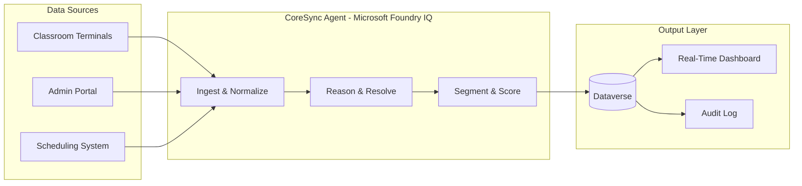

<div align="center">

# CoreSync

### *When data chaos is not an option - real-time reconciliation powered by autonomous reasoning*

<br/>

[](https://github.com)
[](https://github.com)
[](https://github.com)
[](https://python.org)
[](https://azure.microsoft.com)
[](https://microsoft.com)
[](https://powerplatform.microsoft.com)

<br/>

> **CoreSync** is an autonomous reasoning agent that eliminates 30-day manual reconciliation cycles in Simulation Centers,
> replacing them with real-time, AI-driven data synchronization via **Microsoft Foundry IQ**.

</div>

---

## The Challenge (AS-IS)

Simulation Centers operate across multiple physical spaces - classrooms, labs, procedural rooms - each generating its own data stream. The result? A fragmented, error-prone environment that breaks operational continuity.

| Pain Point | Impact |
|---|---|
| **Data silos** between classrooms and administrative systems | No unified student view |
| **Manual check-in / check-out** processes | Missing records, ghost sessions |
| **DNI format inconsistencies** across source systems | Failed reconciliation joins |
| **30-day reporting lag** | Decisions made on stale data |
| **Administrative chaos** | Staff overloaded with data cleanup |

> *Every unresolved inconsistency is a reconciliation debt that compounds over time. CoreSync eliminates it at the source.*

---

## The Solution (TO-BE)

CoreSync deploys an **autonomous reasoning agent** that continuously monitors, normalizes, and reconciles student activity data across all operational touchpoints of a Simulation Center.

- **Intelligent normalization** - DNI formats are standardized before any join operation is attempted
- **Conflict resolution** - Missing check-outs are inferred from session context, scheduling rules, and historical patterns
- **Automatic segmentation** - Students are categorized in real time by cohort, status, and simulation progress
- **Zero-latency pipeline** - What took 30 days now happens continuously, without human intervention
- **Closed-loop feedback** - Every resolved inconsistency trains the agent's heuristics for future cases

---

## Tech Stack

| Layer | Technology | Role |
|---|---|---|
| **Reasoning Engine** | Azure OpenAI (GPT-4o) | Multi-step decision making, conflict resolution logic |
| **Agent Orchestration** | Microsoft Foundry IQ | Autonomous agent lifecycle, tool routing, memory |
| **Data Layer** | Microsoft Dataverse | Unified record storage, entity modeling, audit trail |
| **Runtime** | Python 3.11+ | Core agent logic, normalization pipelines, connectors |
| **Integration** | Power Platform Connectors | Real-time triggers from source systems |

---

## Reasoning Logic

CoreSync does not follow a rigid script. It **reasons** through each reconciliation task using a structured cognitive loop:

**Step 1 - Data Ingestion**
Raw records arrive from multiple sources: classroom terminals, administrative portals, scheduling systems. Each record carries metadata about its origin system and timestamp.

**Step 2 - Identity Normalization**
The agent applies a multi-pass normalization strategy on DNI fields: strip whitespace, unify character encoding, validate format against national patterns, and hash for deduplication.

**Step 3 - Session Graph Construction**
Check-ins are matched against expected check-outs. The agent constructs a temporal session graph per student and flags open edges (sessions without a closing event).

**Step 4 - Conflict Resolution**
For each flagged inconsistency, the agent queries Foundry IQ's reasoning chain:
- Was the student scheduled for this session?
- Did a subsequent check-in from the same student imply a prior check-out?
- Does the session duration exceed the maximum allowed window?

Based on these inferences, the agent either resolves the record or escalates with a confidence score.

**Step 5 - Segmentation & Output**
Reconciled records are written back to Dataverse with enriched metadata: segment tags, resolution method, confidence level, and a full audit trail.

---

## Architecture Flow



---

## Why This Stack?

Every technology choice in CoreSync was made for a specific, defensible reason - not for hype.

**Azure OpenAI over generic LLM APIs**
Operating within the Microsoft ecosystem means data never leaves the tenant boundary. For institutions handling student PII, this is non-negotiable. Azure OpenAI delivers enterprise SLAs, compliance certifications, and RBAC integration out of the box.

**Microsoft Foundry IQ over custom orchestration**
Building a custom agent orchestrator from scratch introduces weeks of infrastructure work before any business logic is written. Foundry IQ provides a production-ready runtime for autonomous agents - tool routing, memory management, retry strategies - so CoreSync ships with reasoning logic, not boilerplate.

**Dataverse over standalone databases**
Dataverse is not just storage. It is a governed, auditable, relationship-aware data platform that integrates natively with the Power Platform ecosystem. For a Simulation Center already using Dynamics or Power Apps, CoreSync plugs in without an integration layer.

**Python as the runtime**
The data engineering and AI ecosystems both live in Python. Libraries for normalization, fuzzy matching, and Azure SDK integration are mature, well-documented, and fast to iterate on during a hackathon timeline.

---

## Getting Started

```bash
# Clone the repository
git clone https://github.com/your-username/coresync.git
cd coresync

# Install dependencies
pip install -r requirements.txt

# Configure environment
cp .env.example .env
# Add your Azure OpenAI endpoint, Foundry IQ credentials, and Dataverse connection string

# Run the agent
python agent/main.py
```

> Full environment setup documentation is available in [`/docs/setup.md`](./docs/setup.md)

---

## Project Structure

```
coresync/
├── agent/
│   ├── main.py              # Agent entry point
│   ├── normalizer.py        # DNI & field normalization
│   ├── resolver.py          # Conflict resolution logic
│   └── segmenter.py         # Student segmentation
├── connectors/
│   ├── dataverse.py         # Dataverse read/write
│   └── foundry.py           # Foundry IQ tool bindings
├── config/
│   └── settings.py          # Environment configuration
├── docs/
│   └── setup.md             # Deployment guide
├── tests/
│   └── test_normalizer.py   # Unit tests
├── .env.example
├── requirements.txt
└── README.md
```

---

<div align="center">

## Community & Updates

</div>

### What is CodeNoZhiend?

This channel is my space to document the **"unfiltered side"** of programming. You'll find everything from technical breakdowns of coding and database challenges, to the culture and lifestyle behind the dev.

If you're looking for real-world layouts, algorithmic problem solving, or just want to understand what working in tech actually feels like - this is the place.

[Check out the content at **@CodeNoZhiend**](https://www.youtube.com/@CodeNoZhiend)

<div align="center">

---

*Built for the **Agents League Hackathon** - Reasoning Agents Track*
*Made with precision, caffeine, and a genuine intolerance for manual processes*

</div>
